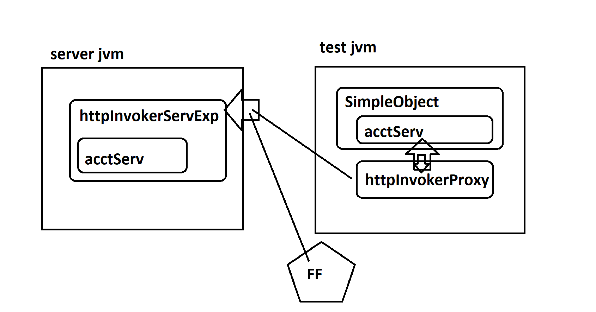

# httpInvokerServiceExporterRCE

The purpose of this project is to understand and demonstrate a proof
of concept for `CVE-2016-1000027`.

`CVE-2016-1000027` is a Remote Code Execution Vulnerability caused 
when the `HttpInvokerServiceExporter.readRemoteInvocation` method 
deserializes a malicious Java object.

In this project we will be looking at how the vulnerability works
and how to prevent it.

The diagram below outlines how the HttpInvokerServiceExporter and
accompanying proxy can be used to allow one JVM to call methods
on a Java object in a different JVM via a Http Endpoint.

(FF) stands for Firefox. E.G. when we send a get call
to the endpoint.

# Resources:
 - https://nvd.nist.gov/vuln/detail/CVE-2016-1000027
 - https://bugzilla.redhat.com/show_bug.cgi?id=CVE-2016-1000027
 - https://www.tenable.com/security/research/tra-2016-20
 - https://security-tracker.debian.org/tracker/CVE-2016-1000027
 - https://www.contrastsecurity.com/security-influencers/protect-your-apps-from-java-serialization-vulnerability
 - https://portswigger.net/web-security/deserialization/exploiting